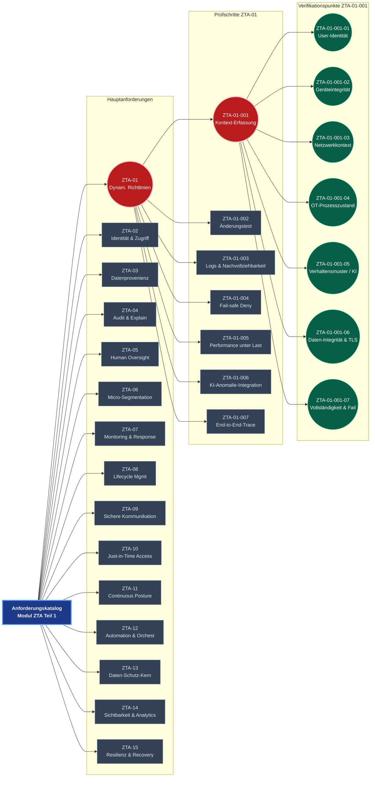

# Compliance-Dokumentation für ZTA+KI 2026

## Zusammenfassung

Dieses Verzeichnis `/ZTA+KI_2026/Compliance/V2` enthält die **erweiterte, QA-gesicherte und auditfähigere Version 2** der Compliance-Dokumente für eine Zero Trust Architektur (ZTA) mit KI-Assistenz im Industrie-4.0-Kontext. 

Im Vergleich zur V1 (im Parent-Ordner) wurden die Inhalte stark operationalisiert: vollständige Sätze statt Stichpunkte, Evidenz-Nachweis-Spalten, detaillierte Rollen/RACI, Risiko-Matrizen, KPIs, Lifecycle-Abdeckung, Review-Prozesse und ein separates SoA-Dokument mit Mapping aller 38 ISO/IEC 42001 Annex-A-Controls. 

Die Dokumente sind für C-Level, Legal, CISO, Auditoren und Implementierer konzipiert und gewährleisten höhere Konformität mit EU AI Act, ISO/IEC 42001, NIST SP 800-207, IEC 62443 und ISO 27001. V2 dient als zertifizierbare Vorlage (nahe 10/10 Audit-Reife).

## File-Struktur

Die Dateien sind thematisch gegliedert:

- **Compliance / Governance**  
  - [Data-_und_AI-Governance.md](Data-_und_AI-Governance.md)

- **Policies**  
  - [Policy.md](Policy.md)

- **Modules ZTA 1–3**  
  - [Modul_ZTA_Teil_1.md](Modul_ZTA_Teil_1.md)  
  - [Modul_ZTA_Teil_2.md](Modul_ZTA_Teil_2.md)  
  - [Modul_ZTA_Teil_3.md](Modul_ZTA_Teil_3.md)

- **SoA (Statement of Applicability)**  
  - [SoA.md](SoA.md)

## Erklärung der einzelnen Files

### Data-_und_AI-Governance.md
Dieses Dokument stellt das erweiterte Data- und AI-Governance-Rahmenwerk dar (V2). Es richtet sich primär an Geschäftsführung, C-Level und Legal. Es umfasst Rahmenbedingungen (§1), Ziele (§2), Klassifizierung von KI-Systemen (§3), Rollen & RACI-Matrix (§4), menschliche Aufsicht mit Eskalationstriggers (§5), Risikomanagement mit Beispiel-Matrix (§6), vollständiges Controls-Mapping / SoA (§7), Monitoring/KPIs/Review (§8) sowie Anhänge. 

Im Vergleich zu V1 wurde es um formale RACI, Risiko-Matrix, KPIs, Review-Zyklus und detailliertes SoA-Mapping erweitert, um ISO 42001 Stage-1/2-Readiness zu erreichen.

### Policy.md
Dieses Dokument enthält die erweiterte Policy zum Einsatz von ZTA und KI in Industrie 4.0 (V2). Zielgruppe sind Fachabteilungen, OT-Security und CISO. Struktur: Rahmenbedingungen, Ziele/Grundsätze, Motivation, Zugriffssteuerung (Tabelle), Integrität/Datenprovenienz (Tabelle), Nachvollziehbarkeit/Transparenz (Tabelle), Sicherheit/Monitoring (Tabelle), Review/Aktualisierung mit KPIs (Tabelle). 

Ergänzungen zu V1: Tabellen mit vollständigen Sätzen, ZTA-Pillar-Mapping, Incident-Response-Abschnitt, KPIs und Lifecycle-Integration für höhere Operationalisierbarkeit.

### Modul_ZTA_Teil_1.md
Der erweiterte generische Anforderungskatalog für ZTA+KI (V2). Zielgruppe: Techniker, Evaluatoren, Auditoren. Enthält Risikoklassifizierung/Security Levels, Tabelle mit Anforderungen ZTA-01 bis ZTA-15 (erweitert um Automation, Resilienz, Analytics), Lifecycle-View, vollständiges SoA-Mapping (Annex A + IEC SRs) sowie Evidenz-Spalte. 

Im Vergleich zu V1 deutlich erweitert (mehr IDs, Evidenz, Mapping-Tiefe, Changelog).

### Modul_ZTA_Teil_2.md
Exemplarische Prüfschritte zur Verifizierung der Dynamischen Richtlinienanpassung – ausschließlich für Anforderung ZTA-01 (V2). Tabelle mit Prüfschritten (ZTA-01-001 bis -007), Beschreibung, erwartetem Ergebnis, Status, Referenz und neuer Evidenz-Spalte. Scope-Hinweis: Nur ZTA-01; weitere Anforderungen fehlen noch und müssen analog ergänzt werden.

### Modul_ZTA_Teil_3.md
Detaillierte attributbasierte Verifikation der Kontextdatenerfassung – ausschließlich für Prüfschritt ZTA-01-001 (V2). Tabelle mit Verifikationspunkten (ZTA-01-001-01 bis -07) für User-Identität, Geräteintegrität, Netzwerk, OT-Prozesszustand, Verhalten usw., inkl. Evidenz-Spalte. Scope-Hinweis: Nur ZTA-01-001; weitere Prüfschritte und Anforderungen fehlen und müssen ergänzt werden.

### SoA.md
Das eigenständige **Statement of Applicability** (V2) mit granularer Auflistung aller 38 Controls aus ISO/IEC 42001 Annex A sowie relevanter IEC 62443 SRs. Tabelle mit Control-ID, Titel/Beschreibung, Anwendung, Umsetzung/Referenz, Verantwortlichem, Status und Evidenz/Nachweis. 

Dieses Dokument fasst das Mapping zentral zusammen und dient als Kernstück für ISO-42001-Zertifizierung oder EU-AI-Act-Conformity-Assessment.
