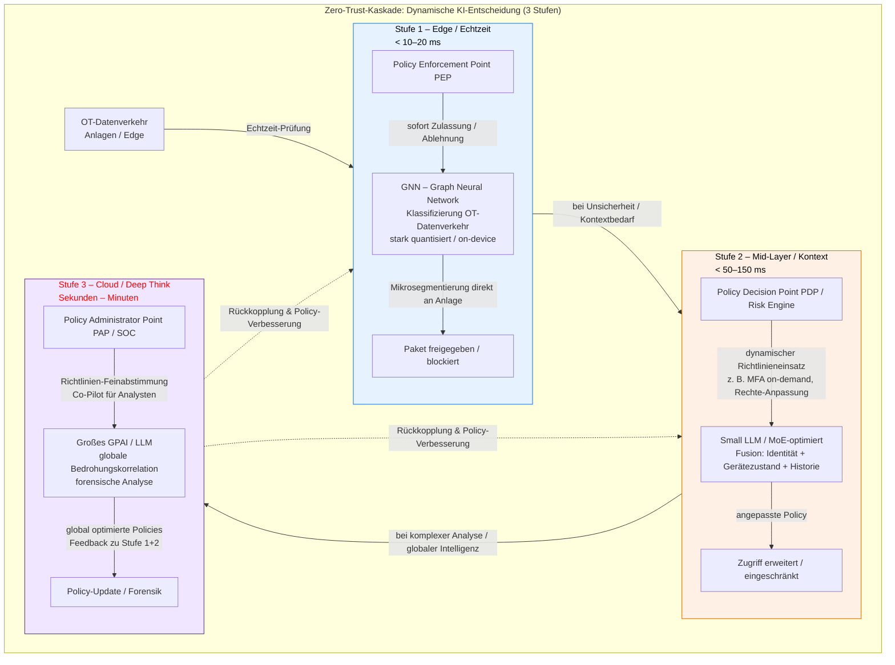

```mermaid

flowchart TD
    subgraph "Zero-Trust-Kaskade: Dynamische KI-Entscheidung (3 Stufen)"

        A[OT-Datenverkehr\nAnlagen / Edge]

        subgraph Stufe_1["Stufe 1 – Edge / Echtzeit\n< 10–20 ms"]
            PEP[Policy Enforcement Point PEP]
            GNN[GNN – Graph Neural Network\nKlassifizierung OT-Datenverkehr\nstark quantisiert / on-device]
            PEP -->|"sofort Zulassung / Ablehnung"| GNN
            GNN -->|"Mikrosegmentierung direkt an Anlage"| B[Paket freigegeben / blockiert]
        end

        subgraph Stufe_2["Stufe 2 – Mid-Layer / Kontext\n< 50–150 ms"]
            PDP[Policy Decision Point PDP / Risk Engine]
            SLM[Small LLM / MoE-optimiert\nFusion: Identität + Gerätezustand + Historie]
            PDP -->|"dynamischer Richtlinieneinsatz\nz. B. MFA on-demand, Rechte-Anpassung"| SLM
            SLM -->|"angepasste Policy"| C[Zugriff erweitert / eingeschränkt]
        end

        subgraph Stufe_3["Stufe 3 – Cloud / Deep Think\nSekunden – Minuten"]
            PAP[Policy Administrator Point PAP / SOC]
            GPAI[Großes GPAI / LLM\nglobale Bedrohungskorrelation\nforensische Analyse]
            PAP -->|"Richtlinien-Feinabstimmung\nCo-Pilot für Analysten"| GPAI
            GPAI -->|"global optimierte Policies\nFeedback zu Stufe 1+2"| D[Policy-Update / Forensik]
        end

        A -->|"Echtzeit-Prüfung"| Stufe_1
        Stufe_1 -->|"bei Unsicherheit / Kontextbedarf"| Stufe_2
        Stufe_2 -->|"bei komplexer Analyse / globaler Intelligenz"| Stufe_3
        Stufe_3 -.->|"Rückkopplung & Policy-Verbesserung"| Stufe_1
        Stufe_3 -.->|"Rückkopplung & Policy-Verbesserung"| Stufe_2

    end

    style Stufe_1 fill:#e6f3ff,stroke:#0066cc,color:#000
    style Stufe_2 fill:#fff0e6,stroke:#cc6600,color:#000
    style Stufe_3 fill:#f0e6ff,stroke:#6600cc,color:#f00

```
